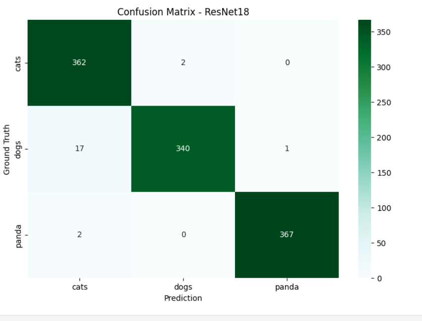

# Building-an-AI-Classifier-Identifying-Cats-Dogs-Pandas-with-PyTorch

# 🐱🐶🐼 Cats vs Dogs vs Pandas – Image Classification with PyTorch  

## 📌 Overview  
This project is an **image classification model** that predicts whether an image is a **cat, dog, or panda** using **transfer learning** and **custom CNN models** in **PyTorch**.  

We use the **Cats vs Dogs vs Pandas dataset** and train with GPU support.  
The project includes:  
1. **Data Splitting** – Train/Test split preparation  
2. **Data Preparation** – Image transformations and data loaders  
3. **Multiple Model Architectures**:  
   - ResNet18 (Transfer Learning) - **~98% Test Accuracy**  
   - Custom CNN  
   - VGG16 (Transfer Learning)  
4. **Training & Evaluation** – Loss tracking, accuracy metrics, confusion matrix  
5. **Streamlit Web App** – Interactive UI for real-time predictions  
6. **Single Image Prediction** – Test function for individual images  

---
---
## 🚀 Deployment

### Hugging Face Spaces (Live Demo)
The model is deployed and available for public use on Hugging Face Spaces:

👉 **[Try the Live Demo](https://huggingface.co/spaces/Gurumurthy1/animal-classifier)**

### Deploy Your Own Version

#### Option 1: Deploy to Hugging Face Spaces

1. **Create a Hugging Face Account**
   - Sign up at [huggingface.co](https://huggingface.co)

2. **Create a New Space**
   - Go to your profile → Spaces → Create new Space
   - Choose **Streamlit** as the SDK
   - Set visibility (Public/Private)

3. **Upload Your Files**
```bash
   git clone https://huggingface.co/spaces/YOUR_USERNAME/YOUR_SPACE_NAME
   cd YOUR_SPACE_NAME
   
   # Copy your files
   cp app.py .
   cp requirement.txt .
   cp -r your_model_files .
   
   # Commit and push
   git add .
   git commit -m "Initial deployment"
   git push
```

4. **Configure the Space**
   - Add a `README.md` header:
```yaml
   ---
   title: Animal Classifier
   emoji: 🐾
   colorFrom: blue
   colorTo: purple
   sdk: streamlit
   sdk_version: 1.28.0
   app_file: app.py
   pinned: false
   ---
```

#### Option 2: Deploy to Streamlit Cloud

1. **Push to GitHub**
```bash
   git init
   git add .
   git commit -m "Initial commit"
   git remote add origin YOUR_GITHUB_REPO_URL
   git push -u origin main
```

2. **Deploy on Streamlit Cloud**
   - Go to [share.streamlit.io](https://share.streamlit.io)
   - Click "New app"
   - Connect your GitHub repository
   - Select branch and file (`app.py`)
   - Click "Deploy"

#### Option 3: Docker Deployment

1. **Create Dockerfile**
```dockerfile
   FROM python:3.9-slim
   
   WORKDIR /app
   
   COPY requirement.txt .
   RUN pip install --no-cache-dir -r requirement.txt
   
   COPY . .
   
   EXPOSE 8501
   
   CMD ["streamlit", "run", "app.py", "--server.port=8501", "--server.address=0.0.0.0"]
```


## ⚡ Dataset  
We used the dataset:  
👉 [Cats, Dogs, Pandas Dataset on Kaggle](https://www.kaggle.com/datasets/ashishsaxena2209/animal-image-datasetdog-cat-and-panda)  

Download inside your notebook/repo:  
```bash
kaggle datasets download -d ashishsaxena2209/animal-image-datasetdog-cat-and-panda -p ./animals --unzip
```

---

## 📂 Project Structure  
```
.
├── animals/              # Original dataset
├── dataset/              # Split dataset (train/test)
│   ├── train/
│   │   ├── cats/
│   │   ├── dogs/
│   │   └── panda/
│   └── test/
│       ├── cats/
│       ├── dogs/
│       └── panda/
├── Untitled.ipynb        # Main training notebook
├── app.py                # Streamlit web application
├── requirement.txt       # Dependencies
└── README.md             # This file
```

---

## 🚀 Quick Start  

### 1. Install Dependencies  
```bash
pip install -r requirement.txt
```

### 2. Run the Streamlit App  
```bash
streamlit run app.py
```

### 3. Train Your Own Model  
Open `Untitled.ipynb` in Jupyter and run all cells.

---

## 📊 Model Performance

| Model | Test Accuracy | Notes |
|-------|--------------|-------|
| **ResNet18** | **~98.17%** | Best performance, pre-trained on ImageNet |
| Custom CNN | ~85-90% | Lighter model, good for learning |
| VGG16 | ~95-97% | Deep architecture, slower training |

---

## 📸 Sample Output



---

## 🛠️ Technologies Used

- PyTorch & torchvision
- Streamlit
- scikit-learn
- matplotlib & seaborn

---

## ✅ Result

Successfully implemented a multi-class image classifier for identifying cats, dogs, and pandas using PyTorch with **98%+ test accuracy**.
